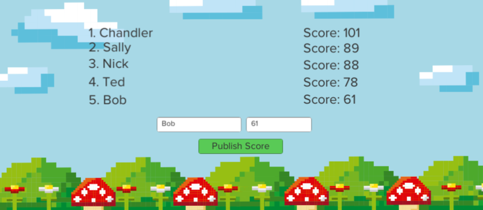

# Real-time Unity Score Leaderboard with PubNub #

⚠️ This tutorial is out of date: While this tutorial series contains useful information, this post was written using an older version of Unity (2018 LTS version) and PubNub's Unity SDK. Check out our [Unity Karting Game Tutorial](https://www.pubnub.com/tutorials/unity-pubnubprix/) that contains a step-by-step walkthrough in adding chat and leaderboard to your own game. You can also learn more about how we power our [gaming customers](https://www.pubnub.com/customers/?usecase=gaming) in our [PubNub for Developers](https://www.pubnub.com/developers/) resources.
Have suggestions or questions about the content of this post? Reach out to devrel@pubnub.com. ⚠️

In this Unity tutorial, you'll learn how to create a leaderboard that [updates in real time](https://www.pubnub.com/learn/glossary/what-is-real-time-data/) when a new score is submitted using PubNub. You'll be able to enter usernames and scores as the score values and watch them update from other players in real time. With the [PubNub Unity SDK](https://www.pubnub.com/docs/sdks/unity), you’re able to create real-time games and experiences with ease.



You can view the [tutorial](https://www.pubnub.com/blog/realtime-highscores-leaderboards-in-unity/) that guides you through the process of building a leaderboard step-by-step, as well as watch a [video walkthrough](https://www.youtube.com/watch?v=b42bhUfcLxc) of this tutorial on YouTube.

## Environment Setup

Before you begin, you’ll need to download the [Unity Hub](https://unity.com/download). The Unity Hub is used to manage Unity 2D and Unity 3D projects you’re developing.

Once you’ve downloaded Unity Hub, add any Unity Editor Version equal to or older than 2018 LTS, as the 2018 LTS version was used to create the real-time leaderboard demo application.

Open the Unity Hub, go to the projects tab, and click ‘Add’. 

If you’re using a Unity version newer than 2018 LTS, then you’ll be asked to confirm you want to upgrade the project to a newer version of Unity. Click ‘Confirm’ to continue. When you import the project, you might see an error message in the Unity console window that looks like this:

```error CS0234: The type or namespace name 'TestTools' does not exist```

Fix the error by going to Window > General > Test Runner. Click on the drop-down menu in the top right corner and Enable playmode tests for all assemblies. Close all open Unity windows completely and reopen your project.

## PubNub Account & Functions
* Before you can see the leaderboard demo running properly, you’ll need free API keys from PubNub to continue. To get these keys:
* Sign up for a [PubNub account](https://dashboard.pubnub.com/signup/). 
* Go to your PubNub Dashboard.
* Click Create New App and give your app a name.
* Click Create.
* Click your new app to open its settings, then click its keyset.
* Enable Message Persistence. This is required to remember your scores as well as to sort them in real time.
* Save the changes.
* Copy the Publish and Subscribe keys to a text editor for the next steps.

Next, you need to set up a PubNub Function to sort scores and publish the list to the ‘leaderboard_scores’ channel. To make a Function, navigate back to your application in the PubNub Admin Dashboard.
* On the left-hand side, click the Functions button.
* Create a new Module.
* Create a new Function by giving the function a name and ensure the Event selected is After Publish or Fire. Make sure you are listening to the correct channel name, in this case, the score submission channel is “submit_score”.
* Add the following Functions code:
```
export default (request) => {
    const db = require("kvstore");
    const pubnub = require("pubnub");
    var json = JSON.parse(request.message);
    console.log(json);
    let { username, score } = json;
    //let { username, score } = request.message;
    var scorearrayprevious = [];
    var scorearraynew = [];
    var usernamearraynew = [];
    var usernamearrayprevious = [];
   // db.removeItem("data"); //reset the block
    db.get("data").then((value) => {
        if(value){
            console.log("value", value);
            let i = 0;
            value.score.some(item => {
                console.log("hello", item, score);
                if(parseInt(item) < parseInt(score)){ //Parse into int since variables are currently strings
                    //Score
                    scorearraynew = value.score.slice(0, i);
                    scorearrayprevious = value.score.slice(i, value.score.length);
                    console.log("values", scorearraynew, scorearrayprevious);
                    scorearraynew.push(score);
                    var newScoreList = scorearraynew.concat(scorearrayprevious);
                    newScoreList.splice(-1,1);
                    
                    //Username
                    usernamearrayprevious = value.username.slice(0, i);
                    usernamearraynew = value.username.slice(i, value.score.length);
                    console.log("values", usernamearrayprevious, usernamearraynew);
                    usernamearrayprevious.push(username);
                    var newUsername = usernamearrayprevious.concat(usernamearraynew);
                    newUsername.splice(-1,1);
                    
                    value.score = newScoreList;
                    value.username = newUsername;
                    db.set("data", value);
                    
                    return true; //break out of the loop using Array.prototype.some by returning true
               }
                i++;
            });
            pubnub.publish({
                "channel": "leaderboard_scores",
                "message": value
            }).then((publishResponse) => {
                console.log("publish response", publishResponse);
            });
        } else {
            db.set("data", {
                "username":["unset","unset","unset","unset","unset"], 
                "score":["0","0","0","0","0"]});
        }
    });
    return request.ok();
};
```
*Save your changes, and start the module.

## Build & Run
Open scripts/leaderboard.cs in the project. In the PubNub constructor, add your PubNub publish and subscribe keys.

To try out the demo, click the 'Play' button at the top of the Unity Editor.

If you receive the following error:

```Scene ‘LeaderBoard’ couldn’t be loaded because it has not been added to the build settings or the AssetBundle has not been loaded.```

Follow the steps below:

To fix this, go to File > Build Settings. Click the ‘Add Open Scenes’ button. Then go back to your Project tab, and double-click on the ‘LeaderBoard’ scene. Go back to your Build Settings, and click ‘Add Open Scenes’ once again. Then, in your Project Tab, double-click on the LeaderBoard scene again and run the project.

## Links
- PubNub Account: https://admin.pubnub.com/#/login
- Unity SDK: https://www.pubnub.com/docs/sdks/unity
- Tutorial Link: https://www.pubnub.com/blog/realtime-highscores-leaderboards-in-unity/

## License
Licensed under the Apache License, Version 2.0 (the "License");
you may not use this file except in compliance with the License.
You may obtain a copy of the License at

    https://www.apache.org/licenses/LICENSE-2.0

Unless required by applicable law or agreed to in writing, software
distributed under the License is distributed on an "AS IS" BASIS,
WITHOUT WARRANTIES OR CONDITIONS OF ANY KIND, either express or implied.
See the License for the specific language governing permissions and
limitations under the License.
